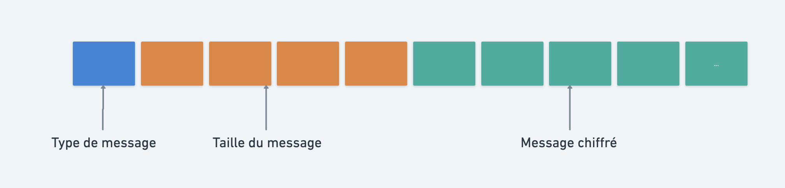

## Zero Knowledge Database

Ce projet est une base de donnée qui a la particularité de traité uniquement avec des données chiffrées.

**Les données sont chiffrées :**

- Au repos
- Pendant le transport
- Pendant leurs utilisations


**Pour cela, on utilise différent algorithme :**

- AES-GMC-SIV (AES Galois Counter Mode with Synthetic Initialization Vector)
- Kyber (protocol post quantique pour la transmission des données)
- Falcon (protocol de signature utilisée par le certificat d'autorité)
- OPE (Order Preserving Encryption) basé sur la distribution hypergéométrique

### Protocole de communication


#### Version plus complete avec authorité de certificat

Le protocol Kyber est un standard retenu et seul finaliste, il n'est pas encore standardisé par la [NIST (National Institute of standard and technology)](https://www.nist.gov/news-events/news/2022/07/nist-announces-first-four-quantum-resistant-cryptographic-algorithms).

Il n'existe donc très peu de serveur qui serve d'autorité de certificat, dans notre cas, nous avons décidé de créer le nôtre.


Voici à quoi va ressembler un certificat.

```toml
public_key = [66, 1, 50, 245, ...]
identity_info = "Server"
issuer_info = "Stuga Cloud Certificate Authority"
signature = [82, 7, 0, 0, 0, 0, 0, 0, 0, 130, 128, 64, 1, 0, 0, 0, 51, 7, 0, 0, 0, 0, 0, 0]
valid_from = "2023-07-05T22:03:41.385509Z"
valid_to = "2024-07-04T22:03:41.385509Z"
serial_number = "3de477e3-1396-4af0-900f-b710e02ea32b"
cipher_suits = ["kyber768", "falcon"]
```

Il utilise une combinaison de Falcon et de kyber, c'est falcon (Algorithme post-quantique de signature courte) qui signe la clef publique du certificat à sa création, plus tard on pourra vérifier son authenticité grâce à ça.

#### Découpage d'un message



```rust
#[derive(Debug, Serialize)]
#[repr(u8)]
pub enum MessageType {
    Setup,
    Authentification,
    Insert,
    InsertOpe,
    InsertResponse,
    Query,
    QueryResponse,
    SingleValueResponse,
    Count,
    Update,
    UpdateResponse,
    Delete,
    DeleteResult,
    DeleteForUsecase,
    Drop,
    DropResult,
    EndOfCommunication,
    CloseCommunication,
}
```

Les messages chiffrées sont serializer avec le protocol [CBOR](https://cbor.io/), Protocol de transfer binaire de donnée optimisé pour être léger sur le reseau.


```rust
#[derive(Debug, Serialize, Deserialize, PartialEq, Eq, Clone)]
pub enum Message {
    ClientSetup(ClientSetupSecureConnection),
    ClientAuthentification(ClientAuthentication),
    Insert(Insertion),
    InsertOpe(InsertionOpe),
    InsertResponse { inserted_id: String },
    Query(Query),
    QueryResponse(QueryOutput),
    SingleValueResponse { data: Option<Vec<u8>>, nonce: Option<Vec<u8>> },
    Count(CountSubject),
    CountResponse(u32),
    Update(Update),
    UpdateResponse { status: UpdateStatus },
    Delete(Delete),
    DeleteResult(bool),
    DeleteForUsecase { collection: String, id: String },
    Drop(DropSubject),
    DropResult(bool),
    EndOfCommunication,
    CloseCommunication,
}
```

### Insertion

`Structure`
```rust
#[derive(Debug, Serialize, Deserialize, PartialEq, Eq, Clone)]
pub struct Insertion {
    pub collection: String,
    pub acl: Vec<String>,
    pub data: Vec<u8>,
    pub usecases: Vec<String>,
    pub nonce: Vec<u8>,
}

#[derive(Debug, Serialize, Deserialize, PartialEq, Eq, Clone)]
pub struct InsertionOpe {
    pub collection: String,
    pub acl: Vec<String>,
    pub data: Vec<u8>,
    pub usecases: Vec<String>,
}
```

`Exemple d'utilisation du client`
```rust
let data_bytes = liserk_client::serialize(&data)?;

let acl = vec!["manager".to_string(), "stock_analyst".to_string()];
let usecases = vec![
    "inventory_management".to_string(),
    "statistical_analysis".to_string(),
];
let collection = "medications".to_string();
let ope_collection = "medication:stock:ope".to_string();

client
    .insert(
        collection,
        data_bytes,
        Vec::new(),
        acl.clone(),
        usecases.clone(),
    )
    .await?;
client
    .insert_ope(stock, acl, usecases, ope_collection)
    .await?;
```

### Query

`Structure`
```rust
#[derive(Debug, Serialize, Deserialize, PartialEq, Eq, Clone)]
pub enum QueryType {
    And,
    Or,
}

#[derive(Debug, Serialize, Deserialize, Clone)]
pub enum Query {
    Single(SingleQuery),
    Compound(CompoundQuery),
    GetById { id: String, collection: String },
    GetByIds { ids: Vec<String>, collection: String },
}

#[derive(Debug, Serialize, Deserialize, Clone)]
pub struct SingleQuery {
    pub collection: String,
    pub usecase: String,
    pub upper_limit: Option<f64>,
    pub lower_limit: Option<f64>,
}

#[derive(Debug, Serialize, Deserialize, Clone)]
pub struct CompoundQuery {
    pub query_type: QueryType,
    pub queries: Vec<Query>,
}

```

`Exemple d'utilisation avec le client`
```rust
let low_stock_query = SingleQueryBuilder::default()
    .with_collection("medication:stock:ope".to_owned())
    .with_usecase("statistical_analysis".to_owned())
    .with_encrypted_field_less_than(80.0)
    .build();


let warehouse_query = Query::GetById {
    id: nearest_warehouse_id.to_string(),
    collection: "stock".to_owned(),
};

let compound_query = CompoundQueryBuilder::default()
    .with_query_type(QueryType::And)
    .with_query(warehouse_query)
    .with_query(Query::Single(low_stock_query))
    .build();

let low_stock_result = db_client.query(Query::Compound(compound_query)).await?;
  ```

## Liste des paquets mis a disposition

- [Liserk-OPE](https://crates.io/crates/liserk-ope)
- [Liserk-shared](https://crates.io/crates/liserk-shared)
- [Liserk-server](https://github.com/Stuga-Cloud/liserk-encrypt/tree/main/server)
- [Liserk-client](https://crates.io/crates/liserk-client)
- [certificate-authority](https://crates.io/crates/certificate_authority)
